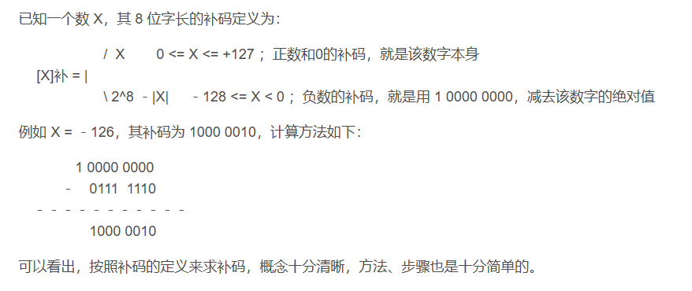
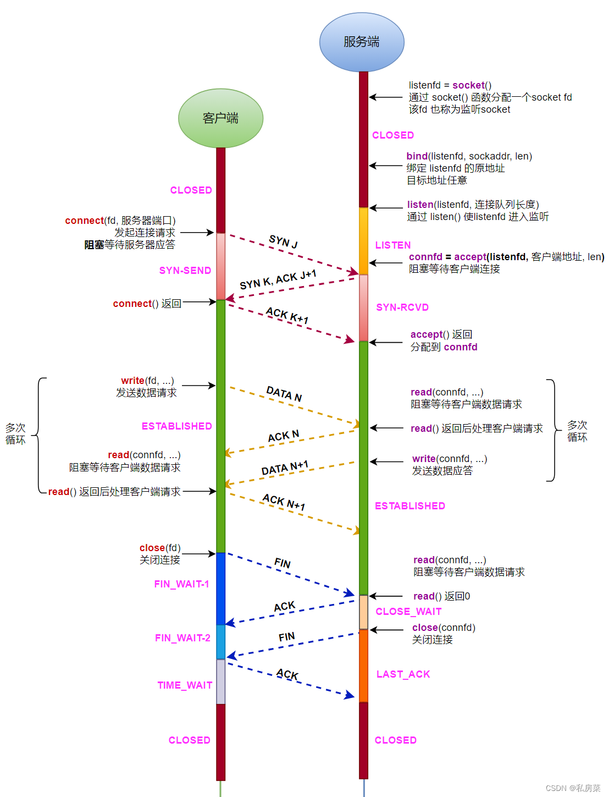

# 一、冯诺依曼体系
## 1.1 二进制表示
### 原码、补码、反码的特性
**原码：** 
首位为符号位，0表示正，1表示负，其余位为数值位
对于8位二进制，存在 +0（0000 0000）， -0（1000 0000）
取值范围： -（2^8-1） 到  （2^8-1） 

**反码：**
由原码，符号位不变，其他取反得到
对于8位二进制，存在 +0（0111 1111）， -0（1111 1111）
取值范围： -（2^8-1） 到  （2^8-1） 

**补码：**
由反码+1   或   负数采用“模减去绝对值”的方法来求，这是求补数的通用方法，适合于各种进制、各种大小的数字。
举个例子：

## 1.2 冯诺依曼体系组成
计算器 控制器 存储器 输入输出设备

## 1.3 冯诺依曼体系两大功能
存储程序：通过输入设备，控制器，将应用控制程序存储在存储器中.

程序控制：按照指令地址访问器，按顺序取出待执行的指令，并通过译码将指令转换为控制信号，实现对计算的控制，实现指令的功能.

# 二、操作系统
## 2.1 进程、线程、协程的区别
进程：资源分配与调度的基本单位，其拥有自己独立的内存空间和系统资源.进程的切换消耗更大

线程：CPU调度的基本单位，线程之间共享其属于的进程的内存空间. 线程的切换开销较小，因为其只需要保存线程的上下文信息，而不是整个进程的状态信息. 但多个线程共享进程的内存空间，因此会出现，数据竞争和内存安全问题.

协程：用户态的轻量级线程，其拥有独立的上下文寄存器和栈空间，但堆空间依旧是共享线程的.协程的切换花销更小，只需要记录和恢复协程的上下文，而和内核级别的调度无关，但协程的管理，完全由程序员进行控制，编程模型最为复杂.

## 2.2 进程之间的通信方式
### 2.2.1 管道
匿名管道：用于亲子进程和兄弟进程

命名管道：可用于任意进程之间的通信

### 2.2.2 消息队列
RabbitMq、RocketMq、Kafka 

### 2.2.3 共享内存
定义：本质上就是内存中的一块区域，用于进程间通信使用。该内存空间由操作系统分配与管理。
共享内存的优缺点
如何利用管道，给共享内存实现访问控制

### 2.2.4 信号量
并发可以提高程序效率，但可能会导致竞争的出现，因此引入了信号量的概念

死锁：是一种特定的状态，主要出现在多线程或多进程环境中.当两个进程或更多进程在程序执行过程中，
因为竞争资源，导致僵持现象，使得整个程序无法进行进一步进行，这种现象就叫做死锁

**死锁的四个条件：**
  1. 互斥
  2. 循环等待
  3. 不可抢占
  4. 占有且等待

介绍一下PV操作

有名信号量、无名信号量

POSIX信号量
### 2.2.5 信号
信号：向进程异步发送的事件通知，通知进程有事件发生

信号的发送和挂起
定时器
信号处理函数signal

实例：用信号实现司机和售票员问题
### 2.2.6 套接字
int socket(int domain, int type, int protocol);

int bind(int sockfd, const struct sockaddr *addr, socklen_t len);

int connect(int sockfd, const struct sockaddr *addr, socklen_t len);

int listen(int sockfd, int backlog);

int accept(int sockfd, struct sockaddr *restrict addr, socklen_t *restrict len);
ssize_t send(int sockfd, const void *buf, size_t nbytes, int flags);
ssize_t recv(int sockfd, const void *buf, size_t nbytes, int flags);

int close(int fd);

## 2.3了解五种网络IO模型
### 2.3.1 阻塞与非阻塞
**根据等待操作结束的状态划分**
阻塞：调用方在发出请求后必须等待任务完成才能继续执行，这期间调用方会暂停其他工作。
非阻塞：调用方在发出请求后不必等待任务完成，立即返回，可以继续执行其他操作。

### 2.3.2 异步与同步
**从消息的通知方式来划分**
同步：调用方发出请求后主动等待任务完成，知道结果后再继续。通常来说，同步操作是阻塞的.
异步：调用方发出请求后无需等待，而是可以继续执行其他任务。
任务完成后会通过回调、事件或消息的方式通知调用方。

### 2.3.3 五种网络IO模型
(1) 阻塞I/O

(2) 非阻塞I/O

(3) 多路复用I/O
select
poll
epoll
(4) 信号驱动式I/O

(5) 异步I/O

## 2.4 并行和并发的区别
**并行：**
当一个机器有多个CPU时，他可以让多个进程分别使用一个CPU，两个进程同时运行，且互不干扰，互不抢占CPU
资源，可以同时运行，这种方式我们称为并行

**并发**
当只使用一个CPU的时候，可以将CPU的运行时间分为多个小时间段，然后将这些时间段，分配给
多个进程进行调用，但当一个进程在使用时间段的时候，其他进程就处于阻塞状态，这种方式我们称为并发

## 2.5 同步与异步的区别
同步和异步是站在事件完成后，消息是如何告知的角度来划分的
 

**同步**
调用方在发出请求后，采用等待或主动轮询来查看请求是否完成
 
**异步：**
调用方在发出请求后，不需要等待事件的完成，当事件完成时，使用回调、事件、消息通知调用方

## 2.6 阻塞和非阻塞的区别
阻塞和非阻塞是站在，请求发出后，调用方是会停下来等待事件完成，还是会继续执行自己的事务
 

**阻塞：**
调用方在发出请求后，必须停下来等待请求完成，期间不能进行其他操作
 
**非阻塞：**
调用方在发出请求后，不需要等待请求完成，可以立即返回，继续进行其他操作

## 2.7 缓存淘汰算法
### 2.7.1  LFU
Least Frequently Use 最近最不常用算法

### 2.7.2  LRU
least Recently Use 最近最少使用算法

### 2.7.3  FIFO 
First In First Out 先进先出算法

# 三、计算机网络
## 3.1 网络协议
### 3.1.1 应用层协议
**http协议**

**https协议**

**dns协议**

### 3.1.2 传输层协议
**tcp协议**
**udp协议**

### 3.1.3 网络层协议
**ip协议**
**icmp协议**

### 3.1.4 数据链路层协议
**arp协议**

## 3.2 序列化协议
**序列化：**
 
序列化是指将复杂的数据结构（字典，数组，链表）或对象，转变为特定的格式，以便存入文件、数据库，或是进行网络传输

**反序列化：**
 
反序列化是序列化的逆过程，是指将存储或传输过程的数据，转变为内存中的数据结构或对象的过程

**常见的序列化格式有：**
 
Json，Xml，二进制

## 3.3 网络七层体系结构
在五层网络体系结构的第4层和第5层之间，插入了**会话层**和**表示层**

## 3.4 网络四层体系结构
将五层网络体系结构的第1,2层，合并为**网络接口层**

# 四、数据结构
需要去看一下 二叉树部分一些特殊树（b+，b，b-，红黑树的结构和具体操作）、堆的定义以及具体操作